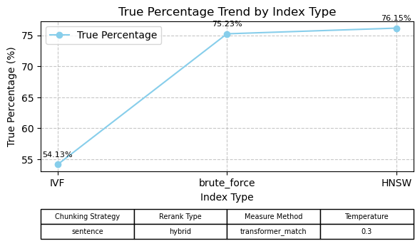
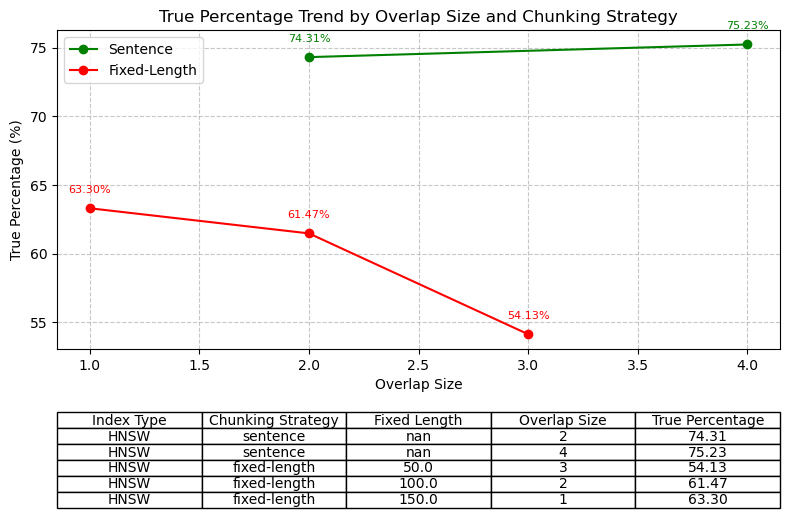
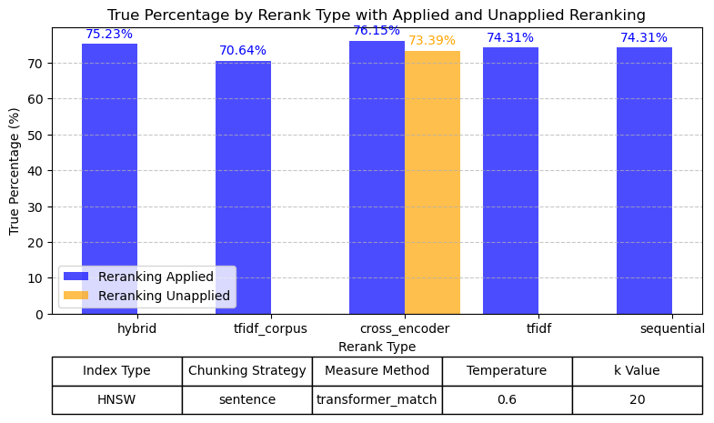
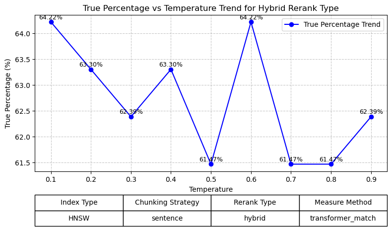
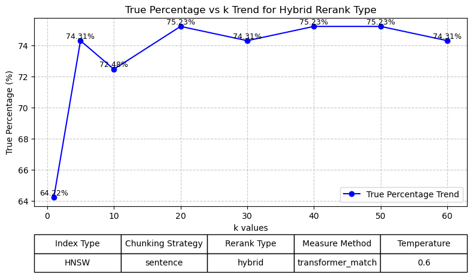
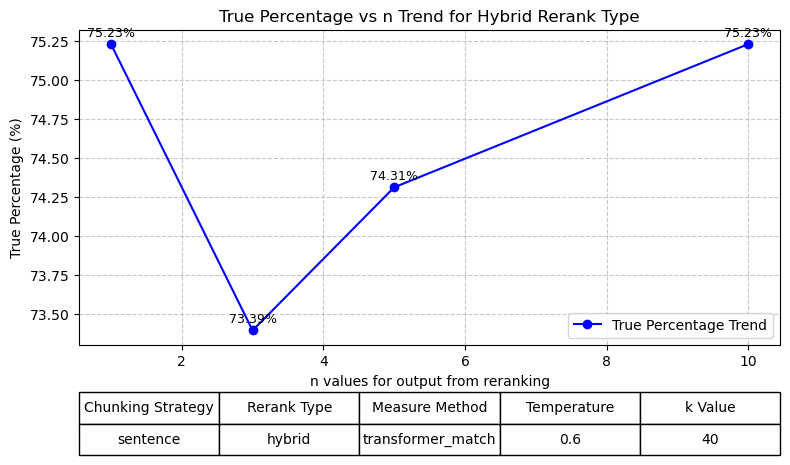

# TextWave Object Det

## Table of Contents
1. [System Design](#system-design)
2. [Metrics Definition](#metrics-definition)
3. [Analysis of System Parameters and Configurations](#analysis-of-system-parameters-and-configurations)

---
## System Design

### 1. Extraction Service

The Preprocessing Service is responsible for preparing the input text documents for the pipeline. It processes raw text documents by chunking them based on the specified strategy (e.g., sentence-level or fixed-length chunking) and embedding these chunks into vector representations.

### 2. Retrieval Service

The Retrieval and Reranking Service indexes the chunked embeddings using the FAISS index through various indexing strategies (e.g., HNSW, IVF) to balance scalability and accuracy. Once the top-k nearest neighbors are retrieved, the service can apply a reranking step using a hybrid, cross-encoder, or other reranking methods. The system is designed to handle user-defined k-values, controlling the number of top documents considered for answer generation. By dynamically reranking the retrieved results, the service ensures that the most relevant context is prioritized for question answering.

### 3. Interface Service

The Interface Service provides a unified API that integrates preprocessing, retrieval, reranking, and question-answering functionalities within the Pipeline class. It streamlines operations such as preprocessing new documents into embeddings (preprocess_corpus), incrementally adding them to the FAISS index (add_to_corpus), conducting k-nearest-neighbor searches (search_neighbors), and generating answers using retrieved results (generate_answer). The service also includes Flask endpoints to trigger question-answering (/qa), add new documents (/add), and track system performance with latency metrics.

---

## Metrics Definition

### Offline Metrics

- **True Percentage under Transformer Match:** Evaluates the similarity between a generated answer and the ground truth answer using transformer-based language models. This metric leverages pre-trained model (DistilBERT) to assess the semantic alignment between the two text segments. Unlike exact match metrics that require word-for-word correspondence, Transformer Match measures deeper contextual similarity, making it a more robust and appropriate measurement in this question answer system.

### Online Metrics

- **Query Latency:** Measures the time taken for document retrieval and answer generation for each input query. Lower latency indicates faster response times for users.

---

## Analysis of System Parameters and Configurations

This section evaluates significant design decisions made across the Extraction, Retrieval, and Generation Services. Detail on the below 6 design decisions could be found in [reranker_analysis.ipynb](notebooks\reranker_analysis.ipynb).

### 1. Choice of Index Type (Retrieval Service)

**Consideration:** Different index types are evaluated to balance memory usage, retrieval speed, and accuracy. The choice of index directly affects the system's scalability and performance, especially as the dataset grows to billions of text chunks.

**Evaluation:** `IVF`, `Brute Force`, and `HNSW` indexes are evaluated for Model: mistral-large-latest with sentence-level chunking and reranking enabled. The evaluation focused on the true percentage of correct answers, using a low temperature (0.3) for question generation and transformer_match as the metric for accuracy measurement. The results indicate that Brute Force indexing outperformed IVF, but HNSW offered the best balance, achieving the highest accuracy of 76.15% with efficient query handling and scalability.

**Decision:** Choose `HNSW` for large-scale indexing due to its strong balance of speed and accuracy, making it ideal for scalable systems. While Brute Force delivers high accuracy, its computational cost limits its practicality for large datasets.

### 2. Choice of Chunking Strategy (Extraction Service)

**Consideration:** Different chunking strategies are evaluated to optimize the true percentage of correct answers while considering factors such as overlap size and text granularity.

**Evaluation:** The strategies `sentence` and `fixed-length` were tested using the Model: mistral-large-latest with HNSW as the index type and reranking NOT enabled. The evaluation measured true percentage accuracy at a low temperature (0.3) for question generation and used transformer_match as the metric. For sentence chunking, results showed consistently high accuracy with minimal variation across overlap sizes, achieving a maximum of 76.15% true percentage. In contrast, the fixed-length strategy exhibited decreasing accuracy with decreased fixed length, even with increased overlap length. This decline is likely because fixed-length chunks may truncate meaningful context, while sentence-level chunking inherently adapts to natural boundaries in the text, preserving contextual information.

**Decision:** Choose the `sentence` chunking strategy for its higher and more stable accuracy across overlap sizes. While the fixed-length strategy may be useful for tasks requiring uniform chunk lengths, its tendency to lose context at smaller lengths and the challenge of matching average sentence lengths make it less practical for this system.

### 3. Choice of Reranking Type (Retrieval Service)

**Consideration:** Different reranking types are evaluated to optimize retrieval accuracy. The choice of reranking type impacts both the quality of retrieved results and system efficiency, especially when processing large-scale datasets with billions of text chunks.

**Evaluation:** six reranking strategies—`hybrid`, `tfidf_corpus`, `cross_encoder`, `tfidf`, `sequential`, and `No reranking applied`—were evaluated using the HNSW index and Model: mistral-large-latest with sentence-level chunking at k=20. The evaluation measured the true percentage of correct answers, using temperature of 0.6 for question generation and transformer_match as the metric. Results showed that the cross encoder and hybrid method achieved the highest performance, with 76.15% and 75.23% accuracy respectively when reranking applied. Note that accuracy when no reranking is higher than accuracy with reranking of tfidf_corpus, this might due to no reranking considers a broader set of 20 documents, which increases the chance of including critical context that might otherwise be excluded in the top 5 selected by tfidf_corpus reranking.

**Decision:** The `hybrid` reranking type is recommended due to its superior accuracy and consistent performance and is set to be the default mode in this system.

### 4. Choice of Temperature Setting (Generator Service)

**Consideration:** Different temperature settings were evaluated to balance the diversity of generated answers with the accuracy of retrieval results. Temperature directly affects the randomness of the model’s predictions, influencing both the creativity and correctness of the generated answers.

**Evaluation:** Temperature settings in `range 0.1 to 0.9` were evaluated for the HNSW index with sentence-level chunking, no reranking, and k=1, using transformer_match as the evaluation metric. The results show that the highest accuracy, 64.22%, was achieved at temperatures of 0.1 and 0.6. However, the accuracy fluctuated across the range and the optimal temperature may also change with different k values and reranking enabled.

**Decision:** Choose temperature of `0.6` for achieving optimal performance in terms of accuracy in this case study.

### 5. Setting k in Top-k Search (Retrieval Service)

**Consideration:** The parameter k determines the number of nearest neighbors initially retrieved during the search process before reranking. Larger k values provide a broader pool of candidate documents, potentially improving accuracy by including more relevant results. However, when k>5, the reranking system limits the reranked documents to the top 5 to maintain relevant accuracy while control the noise introduced.

**Evaluation:** Various k values `(k = 1, 5, 10, 20, 30, 40, 50, 60)` were tested for the HNSW index with sentence-level chunking and hybrid reranking at a fixed temperature of 0.6, using transformer_match as the evaluation metric. The results indicated that as k increased to 20, the accuracy reached to 75.23% and stabilized at this level for k more than 20. In this case, k=40 can basically ensure the accuracy and coverage of relevant documents with reranking in this case.

**Decision:** An optimal k value k=40 is recommended as the optimal choice for balancing retrieval accuracy and computational efficiency. While smaller k values like 5 are less computationally intensive, they risk missing relevant documents during retrieval. Conversely, increasing k beyond 20 does not improve accuracy and may only increase resource usage without added benefit.

### 6. Setting n in final output from reranking (Retrieval Service)

**Consideration:** The parameter n determines the number of documents returned after reranking. Setting n influences the amount of context available for answer generation, balancing retrieval accuracy with computational efficiency. Higher n values increase context diversity but also introduce more noise, while lower n values focus on fewer, potentially higher-quality documents.

**Evaluation:** Various n-values `(n = 2, 4, 6, 8, 10)` were tested for the HNSW index with sentence-level chunking, hybrid reranking, and transformer_match as the evaluation metric at k=40. The results show that the true percentage of correct answers initially dropped from 75.23% at n=2 to 73.39% at n=4, likely due to insufficient document diversity in the smaller pool. As n increased, the accuracy improved, reaching 75.23% again at n=10, indicating that a larger pool effectively balances relevance and context diversity.

**Decision:** Based on the evaluation, n=10 is recommended as it provides the best balance between retrieval accuracy and contextual diversity, achieving the highest performance (75.23%). Smaller n-values may be suitable for applications prioritizing computational efficiency, but larger n-values should be used when maximizing accuracy is critical.

---

### Summary

The final tuned model is optimized for efficient and accurate question-answering, achieving a true percentage of around 75.23% under the transformer_match metric. It combines scalable retrieval, effective reranking, and precise answer generation, making it suitable for large-scale deployment.

**Key Parameters:**

- Index Type: HNSW
- Rerank Type: Hybrid
- Generator Model: mistral-large-latest
- Temperature: 0.6
- k (Retrieval Depth): 40
- n (Final Output): 10
- Measurement: transformer match
